# cyber_estate — architecture

> **Front-end consumers below are HISTORICAL.** Every `www/*.js` card and
> every `dashboards/*.yaml` board this document names was deleted — the card
> fleet and its 54 `/local/` resource registrations by GH-564, the 41 dead
> board files and the card-era tooling by GH-575. Verified live: the Lovelace
> resource registry holds no `/local/` entry and `lovelace/dashboards/list`
> returns `[]`.
>
> What that does and does not invalidate: **the entity, platform and
> resolution content is unaffected** and is still the reference for this
> integration. Only the consumer claims are stale, and they are stale in one
> direction — a card named here as a consumer no longer exists, so "who reads
> this entity" reads as *nobody in this repo* until a dashboard app claims it.
> Those apps live in their own repos (CLAUDE.md §5) and are not greppable from
> here, so absence of a consumer in this document is not evidence there is
> none. A "no consumer found" conclusion reached by grepping `www/` or
> `dashboards/` still holds; the directories it names simply no longer exist.

Siblings: [`cyber_estate.md`](cyber_estate.md) (technical reference) ·
[`cyber_estate_process_flow.md`](cyber_estate_process_flow.md) (control flow
/ execution order) · [`cyber_estate_data_flow.md`](cyber_estate_data_flow.md)
(data lineage) · [`cyber_estate_abstract.md`](cyber_estate_abstract.md)
(plain-language summary) ·
[`cyber_estate_patent_disclosure.md`](cyber_estate_patent_disclosure.md)
(novelty assessment).

This diagram answers **what the static pieces are and how they compose** —
files, modules, the system boundary. Boxes are files/modules, not events or
values; edges are "imports," "constructs," or "is the boundary between this
integration and X," never "triggers" or "carries" (see the two flow diagrams
for those). Verified against every file under
`custom_components/cyber_estate/` this session.

## The central fact: one config entry, three independent subsystems

`cyber_estate` is KAN-344's merge of three formerly-standalone integrations
— `estate_feeds`, `nvd_estate`, `network_inventory` — into one manifest, one
domain (`cyber_estate`), and **one config entry** (`single_config_entry:
true`). Each subsystem kept its own coordinator, its own entity classes, and
(deliberately) its own entity ids from before the merge. The merge unified
plumbing, not logic: `feeds/`, `cve/` and `scan/` do not import each other
and share no runtime state except the dict that holds all three coordinator
references.

```mermaid
flowchart TB
    subgraph HACORE["HA core — system boundary"]
        CE["ConfigEntry / config_entries\n(ONE entry for all three subsystems)"]
        DUC["DataUpdateCoordinator base class"]
        STOREHELPER["Store helper (.storage/)"]
        SVCREG["hass.services registry"]
        DEVREG["device_registry"]
        ENTPLAT["sensor / switch / button\nentity platforms"]
    end

    subgraph CYBERESTATE["custom_components/cyber_estate/"]
        direction TB

        subgraph TOP["Top-level plumbing — owns the merge"]
            direction TB
            TCONST["const.py\nDOMAIN='cyber_estate', PLATFORMS"]
            TINIT["__init__.py\nasync_setup_entry: constructs all 3\ncoordinators, entry.runtime_data = dict"]
            TFLOW["config_flow.py\nCyberEstateConfigFlow: NVD key step\nthen scan-mode menu -> ONE entry"]
            TSENSOR["sensor.py / switch.py / button.py\ndispatchers: resolve runtime_data,\nhand each coordinator to its own subsystem"]
        end

        subgraph FEEDS["feeds/ subsystem — RSS advisories"]
            direction TB
            FCONST["const.py\nFEEDS registry (2 rows), FEEDS_NS"]
            FCOORD["coordinator.py\nEstateFeedsCoordinator\nnever raises"]
            FPARSE["feedparse.py\nPURE — imports nothing from HA\n(feedparser lib used as PARSER ONLY,\nnever fetches)"]
            FENT["entities.py\nFeedSensor x2, EXPLICIT entity_id\npinned to pre-merge names"]
            FCOORD --> FPARSE
            FENT -->|reads| FCOORD
        end

        subgraph CVE["cve/ subsystem — CISA KEV + NVD join"]
            direction TB
            CCONST["const.py\nASSET_RULES, ACCEPTED_RULES,\nKEV_VENDOR_KEYWORDS"]
            CCOORD["coordinator.py\nNvdEstateCoordinator\nnever raises UpdateFailed"]
            CCPE["cpe.py\nPURE — imports nothing from HA\nversion comparison + disposition"]
            CENT["entities.py\n5 sensors: actionable, integrity,\ncoverage, rollup, recent_affected"]
            CCOORD --> CCPE
            CENT -->|reads| CCOORD
        end

        subgraph SCAN["scan/ subsystem — network inventory"]
            direction TB
            SCONST["const.py\nCONF_MODE: local vs agent,\nintervals, PROFILES"]
            SINIT["__init__.py\nasync_setup_scan: mode branch,\nCAN raise ConfigEntryNotReady"]
            SCOORD["coordinator.py\nNetworkInventoryCoordinator base\n-> AgentCoordinator / LocalCoordinator"]
            SJOIN["join.py\nPURE — imports nothing from HA\njoin_hosts(): MAC match vs registry"]
            SPARSE["parse.py\nPURE — nmap XML -> host records,\nmerge_inventory(), prune()"]
            SSCAN["scanner.py\nNmapScanner: subprocess, one at a time"]
            SAPI["api.py\nNetworkInventoryClient: agent-mode HTTP"]
            SSSH["ssh_probe.py\nSshProber: separate SSH reachability pass"]
            SSTORE["store.py\nInventoryStore: local-mode persistence"]
            SOPT["options.py\nSCAN_OPTIONS vocabulary,\nbuild_args(), validate_target()"]
            SSVCVIEW["services_view.py\nPURE — three-state service readings,\ncensus() -- NOT an HTTP view"]
            SENT["entities.py\nrollup sensors (static) +\nEndpointSensor/ServiceSensor (DYNAMIC,\ndiscovered as hosts/services appear)"]
            SSVC["scan_service.py\ncyber_estate.custom_scan /\ncyber_estate.scan_device"]
            SSWITCH["switch_entities.py\nScheduleSwitch x3 (per profile)"]
            SBUTTON["button_entities.py\nScanButton x3 (per profile)"]
            SHELP["helpers.py\nschedule_followup_refresh()"]

            SCOORD --> SJOIN
            SCOORD --> SPARSE
            SCOORD --> SAPI
            SCOORD --> SSVCVIEW
            SCOORD --> SSSH
            SINIT --> SSCAN
            SINIT --> SSTORE
            SSCAN --> SOPT
            SSVC --> SOPT
            SENT -->|reads| SCOORD
            SSWITCH -->|reads| SCOORD
            SBUTTON -->|reads| SCOORD
        end

        TINIT -->|constructs| FCOORD
        TINIT -->|constructs| CCOORD
        TINIT -->|calls async_setup_scan, gets| SCOORD
        TINIT -->|"entry.runtime_data ="| RTDATA["dict: {'feeds':, 'cve':, 'scan':}\nTHE ONLY SHARED STATE\nbetween the three subsystems"]
        TFLOW -->|writes config for all 3| CE
        TSENSOR -->|"resolves runtime_data,\ndispatches to"| FENT
        TSENSOR -->|"dispatches to"| CENT
        TSENSOR -->|"dispatches to"| SENT

        FCOORD -->|subclasses| DUC
        CCOORD -->|subclasses| DUC
        SCOORD -->|subclasses| DUC
        SSTORE -->|wraps| STOREHELPER
        SSVC -->|registers on| SVCREG
        FENT & CENT & SENT -->|registered onto| ENTPLAT
        SENT -->|creates devices via| DEVREG
    end

    subgraph CONSUMERS["Consumers outside the integration"]
        direction TB
        PKGGLOBAL["packages/global_threats.yaml\nsensor.cdc_domestic_24h\n(reads sensor.cdc_domestic_alerts)"]
        PKGMISC["packages/misc.yaml\nsensor.cisa_new_24h\n(reads sensor.cisa_advisories)"]
        PKGKEV["packages/kev_estate.yaml\nsensor.cisa_estate_7d\n(reads sensor.cisa_advisories)"]
        CYBERALERTS["www/cyber-alerts-card.js\nreads nvd_estate_actionable_vulnerabilities,\nnvd_estate_integrity, cisa_estate_7d.\nCARD-LOCAL 0-7 rollup (LAW section 3)"]
        NETSECCARD["www/network-security-card.js\nreads nvd_estate_recent_affected,\nnvd_estate_unmapped_devices, integrity"]
        CVECARD["www/cve-card.js\nreads nvd_estate_recent_affected"]
        PRIOMON["www/priority-monitoring-card.js\nreads sensor.cdc_domestic_24h"]
        SCANCARD["www/network-scan-card.js\nCONTROL ONLY -- calls\ncyber_estate.custom_scan;\ndoes not read scan/ sensor entities"]
    end

    FENT -.->|"entries attribute, via\nsensor.cdc_domestic_alerts"| PKGGLOBAL
    FENT -.->|"entries attribute, via\nsensor.cisa_advisories"| PKGMISC
    FENT -.->|"entries attribute, via\nsensor.cisa_advisories"| PKGKEV
    CENT -.->|actionable, integrity| CYBERALERTS
    PKGKEV -.->|cisa_estate_7d| CYBERALERTS
    CENT -.->|recent_affected, coverage| NETSECCARD
    CENT -.->|recent_affected| CVECARD
    PKGGLOBAL -.->|cdc_domestic_24h| PRIOMON
    SSVC -.->|"service call only"| SCANCARD
    SENT -.->|"NO DASHBOARD CONSUMER FOUND\nfor unknown_hosts / hosts_tracked /\nEndpointSensor / ServiceSensor"| NOSCANCONS["(none)"]

    style NOSCANCONS fill:#3a1a1a,stroke:#c0392b,color:#eee
    style SCANCARD fill:#1a2a3a,stroke:#2b7ac9,color:#eee
    style RTDATA fill:#1a3a2a,stroke:#2b9c6b,color:#eee
```

## Why three coordinators, not one

`entry.runtime_data` is a **dict**, not a single coordinator object —
`{"feeds": EstateFeedsCoordinator, "cve": NvdEstateCoordinator, "scan":
NetworkInventoryCoordinator}` (`cyber_estate/const.py`'s module docstring,
confirmed in `__init__.py:async_setup_entry`). Each platform dispatcher
(`sensor.py`, `switch.py`, `button.py`) resolves this dict once and hands
each subsystem's own coordinator to its own `build_*`/`setup_*` function —
`feeds/entities.py` and `cve/entities.py` never do their own
`hass.data[DOMAIN]` lookup, a leftover pattern from when each was a
standalone integration with its own entry.

The three coordinators poll on **three different clocks** and can fail
**independently**, with independent consequences:

| Subsystem | Coordinator(s) | Poll interval | Can raise at setup? | Can raise on refresh? |
|---|---|---|---|---|
| `feeds/` | `EstateFeedsCoordinator` | 3600s (`SCAN_INTERVAL_SECONDS`) | No | No — never raises `UpdateFailed`, always returns a dict |
| `cve/` | `NvdEstateCoordinator` | 6h (`UPDATE_INTERVAL_HOURS`) | No | No — never raises `UpdateFailed`, always returns a dict |
| `scan/` (agent mode) | `AgentCoordinator` | 10min (`UPDATE_INTERVAL`) | No | **Yes** — `UpdateFailed` on auth/connect/schema failure |
| `scan/` (local mode) | `LocalCoordinator` | 5min tick (`LOCAL_TICK`); sweeps at 1h/24h | **Yes** — `ConfigEntryNotReady` if nmap binary missing | No — sweep exceptions are caught inside the tick and never propagate |

**The one real behavior change the merge introduced**, stated directly in
`__init__.py`'s module docstring: because all three now share one config
entry, a `scan/` setup failure (missing nmap binary, `ConfigEntryNotReady`)
retries the **whole entry**, including the always-succeeding `feeds/` and
`cve/` halves — a wider blast radius than the three standalone integrations
had. Accepted because nmap already works on this host and a merged entry
has one setup lifecycle by construction.

## What's shared vs. separate, precisely

**Shared:**
- One config entry, one domain, one manifest, one `strings.json`/
  `translations/en.json`.
- One options flow (`CyberEstateOptionsFlow`) — but it writes only
  `CONF_ACKNOWLEDGED_MACS`, a `scan/`-only concern; `feeds/` and `cve/` have
  no options.
- One reauth path (`async_step_reauth_confirm`) — but it only ever touches
  `CONF_API_KEY` (the `cve/` subsystem's NVD key) via `data_updates`, which
  merges into `entry.data` rather than replacing it, so a reauth cannot
  touch the `scan/` half of the entry.
- One unload/remove lifecycle (`async_unload_entry`, `async_remove_entry`,
  `async_remove_config_entry_device`) at the top level, which routes
  device-removal requests to `scan/`'s own removal logic by checking
  whether a device's identifiers carry the real top-level `DOMAIN` (only
  `scan/`'s devices do — `feeds/` and `cve/` devices carry their own local
  namespace strings, `estate_feeds`/`nvd_estate`, precisely so this check
  can tell them apart).

**Separate, deliberately:**
- Three coordinators, three polling clocks, three independent failure
  postures (table above).
- Three entity id namespaces: `feeds/` entities keep their pre-merge
  explicit ids (`sensor.cdc_domestic_alerts`, `sensor.cisa_advisories`);
  `cve/` entities use `_attr_has_entity_name = True` under a device named
  "NVD Estate"; `scan/` entities use `_attr_has_entity_name = True` under
  either a scanner device or one device per discovered endpoint.
- Three device-registry footprints: `feeds/` and `cve/` each register one
  fixed device for the life of the entry (never removable — neither
  implements `async_remove_config_entry_device`'s hook, so HA refuses
  removal by default); `scan/` registers one scanner device plus one device
  **per discovered network endpoint**, dynamically, and implements real
  removability logic (an endpoint still being seen refuses removal).
- No shared code path, no shared pure module, no cross-subsystem function
  call. `feeds/feedparse.py`, `cve/cpe.py`, `scan/join.py`,
  `scan/parse.py`, and `scan/services_view.py` are each independently
  HA-free ("pure") modules — the pattern is repeated three times, not
  factored into one shared utility.

## System context

- **HA core boundary**: `feeds/coordinator.py`, `cve/coordinator.py`, and
  `scan/coordinator.py`'s two coordinator classes all subclass
  `homeassistant.helpers.update_coordinator.DataUpdateCoordinator`
  independently. `scan/store.py` wraps `homeassistant.helpers.storage.Store`
  — the only subsystem with its own persisted state; `feeds/` and `cve/`
  keep only in-memory state (`feeds/coordinator.py`'s `_last_good` dict)
  that resets on restart.
- **NVD / CISA KEV boundary**: `cve/coordinator.py` is the only network
  client talking to `services.nvd.nist.gov` and
  `cisa.gov/.../known_exploited_vulnerabilities.json`. Auth is a per-entry
  NVD API key (`CONF_API_KEY`), validated at config-flow time
  (`_validate_nvd_key`) and re-validated implicitly on every 401/403 via
  HA's reauth flow — `async_start_reauth`, never `ConfigEntryAuthFailed`
  (which would take every `cve/` entity unavailable).
- **CDC / CISA advisories boundary**: `feeds/coordinator.py` is the only
  network client talking to `tools.cdc.gov` and `cisa.gov/.../all.xml`. No
  auth. `feedparser` (the PyPI library, still a live `manifest.json`
  requirement) is used strictly as an offline parser in
  `feeds/feedparse.py` — it is handed bytes this coordinator already
  fetched with a bounded timeout, and never performs its own network
  fetch. This is the one thing "feedparser is dead" (as phrased in
  `tools/work_docs/LAW.md`) does **not** mean: the library is alive and in
  use; what died was the old HACS `sensor.feedparser` platform's pattern of
  letting the library do its own unbounded, unmonitored HTTP fetch.
- **Network boundary (scan/, local mode)**: `scan/scanner.py`'s
  `NmapScanner` invokes the `nmap` binary as a subprocess directly inside
  the HA container — the only place in this whole integration that touches
  the LAN itself rather than a cloud API. `scan/ssh_probe.py`'s
  `SshProber` invokes the real `ssh` client binary, a second, independent
  subprocess boundary gated behind its own config flag
  (`CONF_SSH_ENABLED`).
- **Network boundary (scan/, agent mode)**: `scan/api.py`'s
  `NetworkInventoryClient` talks HTTP(S) to a separate, non-HA process (the
  nmap-scanner agent) that does the actual LAN scanning; this container
  never touches the LAN directly in this mode.
- **Dashboard/consumer boundary**: no `www/*.js` file and no `packages/
  *.yaml` file imports or requires anything from `custom_components/
  cyber_estate/` directly — every consumer relationship crosses through
  the entity registry (reading a `sensor.*`/`binary_sensor.*` state or
  attribute by id) or the service registry (calling
  `cyber_estate.custom_scan`/`cyber_estate.scan_device` by domain-qualified
  name). This is the standard HA integration/dashboard boundary, not
  specific to this component.
