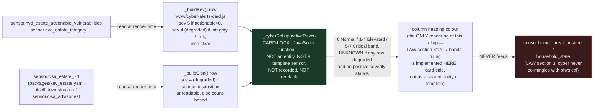

# cyber_estate — data flow

> **Front-end consumers below are HISTORICAL.** Every `www/*.js` card and
> every `dashboards/*.yaml` board this document names was deleted — the card
> fleet and its 54 `/local/` resource registrations by GH-564, the 41 dead
> board files and the card-era tooling by GH-575. Verified live: the Lovelace
> resource registry holds no `/local/` entry and `lovelace/dashboards/list`
> returns `[]`.
>
> What that does and does not invalidate: **the entity, platform and
> resolution content is unaffected** and is still the reference for this
> integration. Only the consumer claims are stale, and they are stale in one
> direction — a card named here as a consumer no longer exists, so "who reads
> this entity" reads as *nobody in this repo* until a dashboard app claims it.
> Those apps live in their own repos (CLAUDE.md §5) and are not greppable from
> here, so absence of a consumer in this document is not evidence there is
> none. A "no consumer found" conclusion reached by grepping `www/` or
> `dashboards/` still holds; the directories it names simply no longer exist.

Siblings: [`cyber_estate.md`](cyber_estate.md) (technical reference) ·
[`cyber_estate_process_flow.md`](cyber_estate_process_flow.md) (control flow
/ execution order) · [`cyber_estate_architecture.md`](cyber_estate_architecture.md)
(static structure) · [`cyber_estate_abstract.md`](cyber_estate_abstract.md)
(plain-language summary) ·
[`cyber_estate_patent_disclosure.md`](cyber_estate_patent_disclosure.md)
(novelty assessment).

This diagram answers **where a value came from and what it became** by the
time it reaches an entity attribute or a downstream consumer. It does not
describe triggers or branching order — see `cyber_estate_process_flow.md`
for that. Verified against every `feeds/`, `cve/`, `scan/` source file,
`packages/global_threats.yaml`, `packages/misc.yaml`,
`packages/kev_estate.yaml`, and `www/cyber-alerts-card.js`,
`www/cve-card.js`, `www/network-security-card.js`,
`www/priority-monitoring-card.js`, `www/network-scan-card.js` this session.

## feeds/ — CDC and CISA RSS to entity attribute to downstream template

```mermaid
flowchart LR
    CDCURL["https://tools.cdc.gov/.../285676.rss"] -->|"fetched, bytes,\nFETCH_TIMEOUT=15s"| FFETCH["_fetch_one()\nfeeds/coordinator.py"]
    CISAURL["https://www.cisa.gov/.../all.xml"] -->|"fetched, bytes"| FFETCH

    FFETCH -->|"body"| FPARSE["project_feed()\nfeeds/feedparse.py\nfeedparser.parse() as PURE PARSER —\nnever fetches itself"]
    FPARSE -->|"entries[], entry_count,\nlatest_key, bozo, version,\nunparsed_dates"| FRECORD["per-feed record dict\n(disposition, detail, stale,\nlast_success, http_status)"]

    FRECORD --> FENT2["FeedSensor\nfeeds/entities.py\nEXPLICIT entity_id, pinned to\npre-merge names"]
    FENT2 --> E1["sensor.cdc_domestic_alerts\nstate=count|None, attrs: entries,\nlatest_key, disposition, detail, stale"]
    FENT2 --> E2["sensor.cisa_advisories\nsame attribute shape"]

    E1 -->|"state_attr(...,'entries')\nparsed with strptime\n('%a, %d %b %Y %H:%M:%S %Z')"| T1["sensor.cdc_domestic_24h\npackages/global_threats.yaml\nage-based severity: <=7d->3,\n8-30d->1, >30d->0"]
    E2 -->|"state_attr(...,'entries')\nparsed with strptime\n('%a, %d %b %Y %H:%M:%S')"| T2["sensor.cisa_new_24h\npackages/misc.yaml"]
    E2 -->|"same entries attribute,\nkeyword-filtered"| T3["sensor.cisa_estate_7d\npackages/kev_estate.yaml\nfilters entries to KEV_VENDOR_KEYWORDS-\nadjacent estate keywords, 7-day window"]

    T1 -->|"sev, headline, link"| C1["www/priority-monitoring-card.js\n_buildCdc(): CDC Domestic row"]
    T3 -->|"state, source_disposition,\nsource_detail, headline, link"| C2["www/cyber-alerts-card.js\nCISA (Estate) row"]

    style FPARSE fill:#1a3a2a,stroke:#2b9c6b,color:#eee
```

**`date_format` is load-bearing, not cosmetic.** `feeds/const.py`'s two
`FEEDS` rows carry a `date_format` string applied inside `project_entry()`
(`feedparse.py`) via `strftime`, and every downstream consumer parses the
resulting string back with a matching `strptime` — `cdc_domestic_24h` uses
`'%a, %d %b %Y %H:%M:%S %Z'`, `cisa_new_24h`/`cisa_estate_7d` use
`'%a, %d %b %Y %H:%M:%S'` (no `%Z` — CISA's feed omits a named zone).
Changing a `date_format` in `feeds/const.py` silently breaks every
downstream `strptime`, which reads as "no recent items" rather than an
error.

## cve/ — device registry + NVD/KEV to disposition to two independent sensors

```mermaid
flowchart LR
    DEVREG["device_registry\n(manufacturer, model, sw_version\nper device)"] -->|"walked every refresh"| DISCOVER["_discover()\ncve/coordinator.py"]
    DISCOVER -->|"classify_device()\nagainst ASSET_RULES/ACCEPTED_RULES,\nowner_domain from primary_config_entry"| ASSETS["assets[] : (device, vendor, product,\nversion_raw, version_tuple, accepted?)"]

    KEVFEED["CISA KEV catalog JSON\n(known_exploited_vulnerabilities.json)"] -->|"filtered: KEV_VENDOR_KEYWORDS,\n90-day WINDOW_DAYS cutoff"| KEVIDS["kev_ids{cve_id: kev_entry}"]
    NVDAPI["NVD CVE API\n(services.nvd.nist.gov)"] -->|"one _fetch_cve() call\nper surviving KEV id"| CVEOBJ["cve_obj\n(configurations, cpeMatch nodes,\nCVSS metrics)"]

    ASSETS --> MATCHNODES["nodes_for(cve_obj, vendor, product)\ncve/cpe.py — PURE\nvulnerable:false platform nodes SKIPPED\n(the CVE-2026-11645 kernel/Chrome trap)"]
    CVEOBJ --> MATCHNODES

    MATCHNODES --> DISP["disposition(installed_version, nodes)\ncve/cpe.py — PURE\nAFFECTED > UNKNOWN_VERSION > PATCHED,\nnever guesses PATCHED"]
    DISP --> FINDING["finding: {cve, device, product,\nversion, disposition, kev=True,\nransomware, due, name}"]

    FINDING --> ACTIONABLE["counts[AFFECTED]\n-> 'actionable'\n(None, not 0, unless BOTH\nkev+nvd sources answered)"]
    ACTIONABLE --> SA["sensor.nvd_estate_actionable_vulnerabilities"]

    DISCOVER -->|"unmapped, accepted,\nownership_rejected, version_conflicts"| COVERAGE["coverage dict"]
    COVERAGE --> SC["sensor.nvd_estate_unmapped_devices"]

    ASSETS -->|"one _fetch_window() call\nper distinct (vendor,product,version)"| WINDOWFETCH["_sweep_window()\nvirtualMatchString query,\nversion IN the query string"]
    WINDOWFETCH -->|"cross-checked against\ncpe.disposition() again —\nnever trust NVD's own match alone"| BYTARGET["window_by_target{}\ncrit/high/unrated per target,\nworst-first ordered"]
    BYTARGET --> SR["sensor.nvd_estate_recent_affected"]

    FINDING --> ROLLUPFN["cpe.rollup()\nworst disposition across ALL findings"]
    ROLLUPFN --> SRO["sensor.nvd_estate_rollup"]

    DISP -.->|"sources.nvd/.kev status,\nerrors[]"| SI["sensor.nvd_estate_integrity\nDIFFERENT AUDIENCE, never feeds\nactionable's severity"]

    SA --> CA1["www/cyber-alerts-card.js\nKEV (Actionable) row —\nONLY consumer of this entity"]
    SI --> CA1
    SR --> NS1["www/network-security-card.js\nCVE EXPOSURE BOARD"]
    SR --> CVC1["www/cve-card.js\none tile per target"]
    SI --> NS1
    SI --> CVC1
    SC --> NS1

    style DISP fill:#1a3a2a,stroke:#2b9c6b,color:#eee
    style MATCHNODES fill:#1a3a2a,stroke:#2b9c6b,color:#eee
```

**`actionable` and `recent_affected` are two independently-computed numbers
from the same asset list, and no downstream consumer treats them as
interchangeable** — `cyber-alerts-card.js`'s KEV row reads only
`actionable`; `network-security-card.js` and `cve-card.js` read only
`recent_affected`. Nothing sums or averages them.

## scan/ — nmap/agent output to host record to per-endpoint entity to service census

```mermaid
flowchart LR
    NMAPBIN["nmap subprocess\n(local mode)\n-oX - : XML on stdout"] -->|"raw XML text"| PARSESCAN["parse_scan()\nscan/parse.py — PURE"]
    AGENTHTTP["nmap-scanner agent\n(agent mode)\nGET /api/v1/inventory"] -->|"validated JSON"| INVENTORY["Inventory dataclass\nscan/api.py"]

    PARSESCAN -->|"{host_key: host_record}\nmac, ip, hostname, os, ports[],\nports_scanned (bool, STRUCTURAL —\nfrom <ports> element presence)"| MERGE["merge_inventory()\nscan/parse.py — PURE\ncarries forward ports on a\nliveness-only sweep, never\ncomputes a false delta"]
    MERGE --> STORE2["InventoryStore\n.storage/network_inventory.<entry_id>\ndebounced 30s save"]

    STORE2 -->|"hosts dict"| BUILDVIEW2["_build_view()\nscan/coordinator.py"]
    INVENTORY -->|"hosts dict"| BUILDVIEW2

    DEVREG2["device_registry\n(MACs from every OTHER\nintegration's devices)"] -->|"_known_macs()\nEXCLUDES devices solely\nowned by this entry"| JOINFN["join_hosts()\nscan/join.py — PURE\nnormalise_mac() on BOTH sides"]
    ACKOPT["entry.options\nCONF_ACKNOWLEDGED_MACS"] -->|"_acknowledged_macs()\nread live every refresh"| JOINFN
    BUILDVIEW2 -->|"hosts"| JOINFN

    JOINFN -->|"matched (int),\nunmatched[] (mac/ip/hostname/vendor/os),\nacknowledged[] (same shape),\nunjoinable (int, no usable MAC)"| JOINRESULT["JoinResult"]

    JOINRESULT --> SU["sensor.unknown_hosts\nstate = unmatched count ONLY\n(acknowledged does NOT subtract\nfrom this state, but travels in attrs)"]
    JOINRESULT --> ST["sensor.hosts_tracked / hosts_up /\nexposed_services / never_port_scanned"]

    BUILDVIEW2 -->|"per-host record"| ENDPOINTENT["EndpointSensor x5 per host\n(ip_address, operating_system,\nlast_seen, open_ports, last_port_scan)\nDYNAMICALLY created as hosts appear"]

    BUILDVIEW2 -->|"host.ports[]"| SVCVIEW["services_for_host() / reading_for()\nscan/services_view.py — PURE\nthree-state: open/closed/never_scanned"]
    SVCVIEW --> SERVICEENT["ServiceSensor per (host,service)\ne.g. sensor.pi4kiosk04_ssh\nDYNAMICALLY created, NEVER removed"]
    SVCVIEW --> CENSUS["census()\nestate-wide rollup"]
    CENSUS --> SSC2["sensor.service_census\nattrs: services{}, coverage_pct"]

    SVCVIEW -->|"host_runs_ssh() gate"| SSHPROBE["SshProber.async_probe()\nreal ssh subprocess,\nseparate 6h clock"]
    SSHPROBE --> SSHENT["SshAccessSensor per host\nauthorized/refused/host_key_changed/\nunreachable/no_ssh/never_scanned"]

    SU -.->|"NO DASHBOARD CONSUMER FOUND"| NOCONS2["(none — grepped packages/*.yaml,\nwww/*.js, dashboards/*.yaml)"]
    ENDPOINTENT -.->|"NO DASHBOARD CONSUMER FOUND"| NOCONS2
    SERVICEENT -.->|"NO DASHBOARD CONSUMER FOUND"| NOCONS2
    SSHENT -.->|"NO DASHBOARD CONSUMER FOUND"| NOCONS2
    SSC2 -.->|"NO DASHBOARD CONSUMER FOUND"| NOCONS2

    SVCSCHEMA["scan/options.py\nSCAN_OPTIONS vocabulary"] -->|"drives services.yaml AND\nthe HA service-call schema —\nONE source, never duplicated"| SVCCALL["cyber_estate.custom_scan /\ncyber_estate.scan_device"]
    SVCCALL -->|"triggers a scan;\nresult folds back into MERGE"| MERGE
    SVCCALL --> SCANCARD2["www/network-scan-card.js\nreads the SERVICE REGISTRY\n(hass.services[...].fields),\nnever reads scan/'s own sensor entities"]

    style NOCONS2 fill:#3a1a1a,stroke:#c0392b,color:#eee
    style PARSESCAN fill:#1a3a2a,stroke:#2b9c6b,color:#eee
    style MERGE fill:#1a3a2a,stroke:#2b9c6b,color:#eee
    style JOINFN fill:#1a3a2a,stroke:#2b9c6b,color:#eee
```

## The cyber-alerts-card rollup: a fourth transform, outside any entity

## Gaps this diagram makes explicit

- **`scan/`'s entire sensor output — `unknown_hosts`, `hosts_tracked`,
  `hosts_up`, `exposed_services`, `never_port_scanned`, `service_census`,
  every per-endpoint `EndpointSensor`, every `ServiceSensor`, every
  `SshAccessSensor` — has no dashboard consumer anywhere in `packages/
  *.yaml`, `www/*.js`, or `dashboards/*.yaml`.** The only reference to
  `scan/` outside `custom_components/cyber_estate/` itself is
  `www/network-scan-card.js`, and that card reads the **service registry**
  (`hass.services['cyber_estate']['custom_scan'].fields`) to draw its
  checkboxes and **calls** `cyber_estate.custom_scan` — it does not read
  any `scan/`-produced sensor state or attribute. `unknown_hosts`, the
  entity KAN-294 specifically added an acknowledgement mechanism for so it
  "could reach zero," has no wall, board, or automation watching it reach
  zero or otherwise.
- **`sensor.nvd_estate_actionable_vulnerabilities` has exactly one
  consumer**: `www/cyber-alerts-card.js`'s KEV row. This is the entity
  KAN-286 identified as "the single condition that voids a written risk
  acceptance" (the Android/Chromium risk-acceptance rulings in
  `tools/work_docs/LAW.md`) and gave its first watcher — before v17 of that
  card, nothing in the estate read it at all.
- **The 0-7 Normal/Elevated/Critical severity rollup LAW.md attributes to
  `cyber-alerts-card` is real and does exist**, but it is computed entirely
  client-side in `_cyberRollup()` from the card's own two active rows (KEV
  Actionable, CISA Estate) at render time. It is not an entity, not a
  template sensor, and not backed by any `cyber_estate` output directly —
  it reads two already-downstream entities (`nvd_estate_actionable_
  vulnerabilities`/`nvd_estate_integrity`, and `cisa_estate_7d`, which
  itself is a `packages/kev_estate.yaml` template one hop downstream of
  `sensor.cisa_advisories`). `scan/`'s output plays no role in this rollup
  at all — see `cyber_estate.md` §5 for the full trace against LAW's
  wording.
- **`sensor.cdc_domestic_alerts` and `sensor.cisa_advisories` (feeds/) feed
  three separate downstream templates, not one** —
  `packages/global_threats.yaml`'s `cdc_domestic_24h`,
  `packages/misc.yaml`'s `cisa_new_24h`, and `packages/kev_estate.yaml`'s
  `cisa_estate_7d` all read the same two raw entities' `entries` attribute
  independently, each with its own severity logic. `cisa_new_24h` itself
  has no further consumer (its predecessor template was deleted 2026-08-09
  as dead output, and misc.yaml's own comments say not to re-add it
  without a reader) — `cisa_estate_7d` is the surviving line that reaches
  glass.
