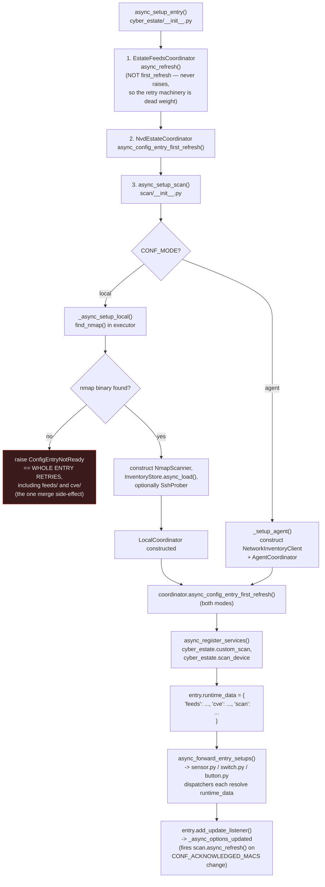
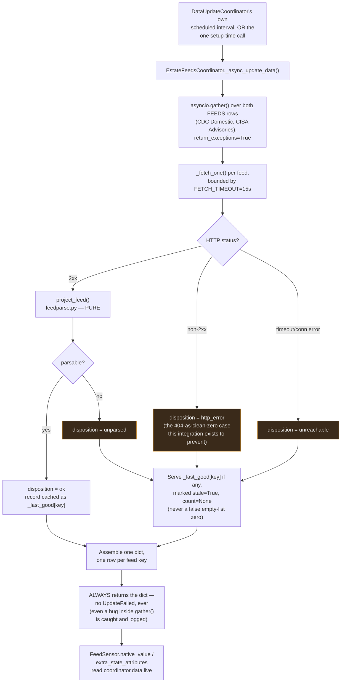
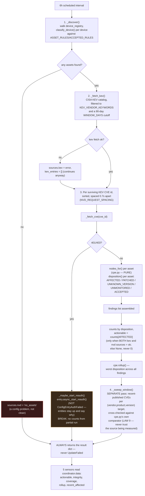
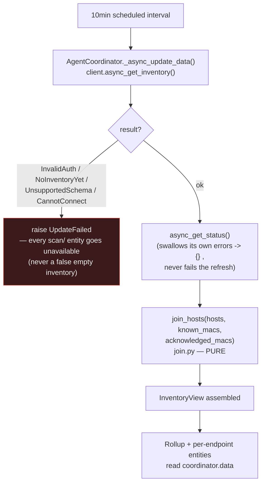
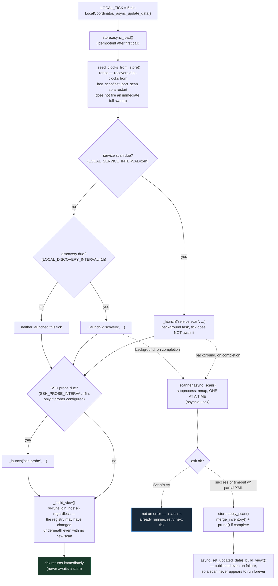
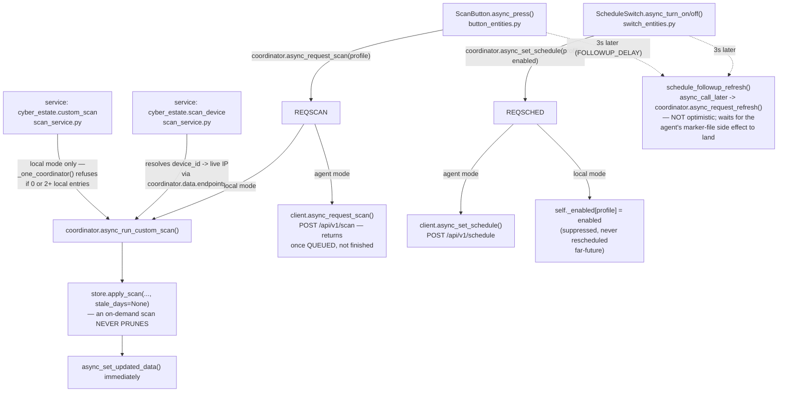

# cyber_estate — process flow

Siblings: [`cyber_estate.md`](cyber_estate.md) (technical reference) ·
[`cyber_estate_data_flow.md`](cyber_estate_data_flow.md) (data lineage) ·
[`cyber_estate_architecture.md`](cyber_estate_architecture.md) (static
structure) · [`cyber_estate_abstract.md`](cyber_estate_abstract.md)
(plain-language summary) ·
[`cyber_estate_patent_disclosure.md`](cyber_estate_patent_disclosure.md)
(novelty assessment).

This diagram answers **what happens, in what order**, from a trigger to an
entity update or a scan actually running. It does not describe what data
moves or where a value originated — see `cyber_estate_data_flow.md` for
that. Verified against `__init__.py`, `feeds/coordinator.py`,
`cve/coordinator.py`, `scan/__init__.py`, `scan/coordinator.py`,
`scan/scanner.py` and `scan/scan_service.py` this session.

## Setup order, and why it matters

Three subsystems set up **sequentially in one coroutine**, not in parallel
— `feeds` first, `cve` second, `scan` third. Only `scan/`'s setup can raise
(`ConfigEntryNotReady` for a missing nmap binary in local mode); `feeds`'s
`async_refresh()` and `cve`'s `async_config_entry_first_refresh()` are both
guaranteed non-raising by their own coordinators' internal contract (see
each subsystem's refresh cycle below).

## feeds/ — refresh cycle (every 3600s, and once at setup)

## cve/ — refresh cycle (every 6h)

**`actionable` (KEV-driven) and `window_by_target` (recent-published sweep)
are computed by two separate passes in the same refresh and must never be
merged** — a KEV entry means CISA confirmed active exploitation; a
recent-window CVE only means NVD published it. `cve/coordinator.py` states
this as a named, deliberate separation, not an oversight.

## scan/ — two independent tick shapes

### Agent mode (poll every 10 minutes)

### Local mode (tick every 5 minutes; a tick is NOT a scan)

## On-demand control paths (both modes, via entities or services)

## Notes on ordering

- **feeds and cve are guaranteed never to raise, at setup or on refresh** —
  `scan` is the only subsystem whose coordinator can raise, and only
  `ConfigEntryNotReady` at setup (local mode, missing nmap) or
  `UpdateFailed` on refresh (agent mode, connectivity/auth/schema
  failures). `LocalCoordinator`'s own tick never raises — every sweep
  exception is caught inside its background task wrapper and logged.
- **A local-mode tick is deliberately decoupled from a scan actually
  running.** The coordinator's scheduled interval (`LOCAL_TICK`, 5 minutes)
  only decides whether a sweep is *due*; the sweep itself runs as a
  fire-and-forget background task so the tick — and, on first setup,
  `async_config_entry_first_refresh` itself — never blocks on a scan that
  can legitimately run for the better part of an hour.
- **`scan/coordinator.py`'s own comment ("ORDERED CHEAPEST FIRST") is
  imprecise**: the code actually checks whether the expensive 24-hour
  service scan is due *before* checking the cheap 1-hour discovery sweep,
  so an overdue service scan is never starved by an always-current
  discovery sweep. The effect (only one sweep launches per tick, priority
  to the one that has waited longer relative to its own interval) is
  correct; "cheapest first" is not the right label for what the ordering
  achieves.
- **The KEV-driven `actionable` count and the recent-window `by_target`
  sweep inside `cve/` are two passes in the same refresh cycle, run in a
  fixed order** (KEV/actionable first, window sweep second) but are never
  combined into one number — see the `cve/` diagram above.
- **A button press or switch flip never optimistically updates its own
  entity state.** Both wait a fixed 3 seconds (`FOLLOWUP_DELAY`,
  `scan/helpers.py`) before re-reading real state, because the underlying
  action (agent-side) or the schedule flag (local-side) takes effect
  asynchronously relative to the HA service call that requested it.
